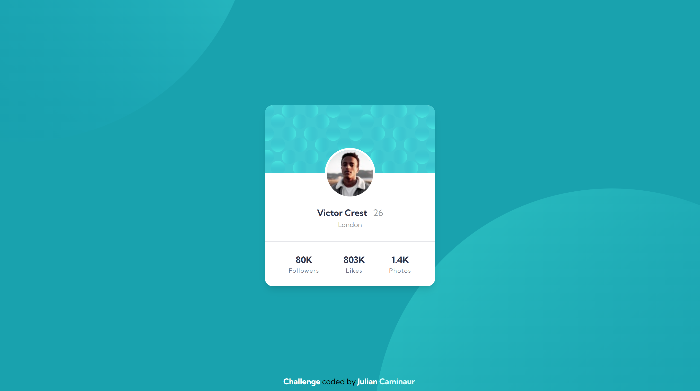
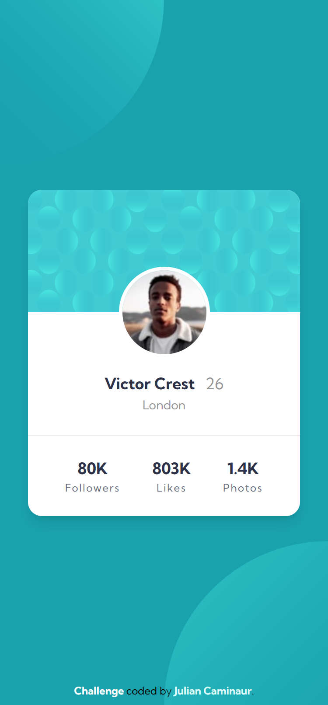

# Frontend Mentor - Profile Card Component Solution

This is a solution to the [Profile Card Component challenge on Frontend Mentor](https://www.frontendmentor.io/challenges/profile-card-component-cfArpWshJ)

## Table of contents

- [Overview](#overview)
  - [The challenge](#the-challenge)
  - [My Solution](#my-solution)
    - [Desktop](#desktop)
    - [Mobile](#mobile)
  - [Links](#links)
- [My process](#my-process)
  - [Built with](#built-with)
  - [Continued development](#continued-development)
- [Author](#author)

## Overview

### The challenge

- Build out the project to the designs provided

### My Solution

#### Desktop

#### Mobile

### Links

- Live Site URL: [Live site](https://caminaur-profile-card-component.netlify.app/)
- Solution URL: [Github](https://github.com/Caminaur/Profile-card-Component)

### Built with

- Semantic HTML5 markup
- CSS custom properties
- Mobile-first workflow
- [React](https://reactjs.org/) (or other tech used)
- [Tailwind](https://tailwindcss.com/)

### Continued development

Working on the mobile first approach and getting better with Taildwind

## Author

- [Website](https://julian-caminaur.tech/)
- [Frontend Mentor](https://www.frontendmentor.io/profile/Caminaur)
- [CSS Battle](https://cssbattle.dev/player/caminaur)
- [Exercism](https://exercism.org/profiles/Caminaur)
